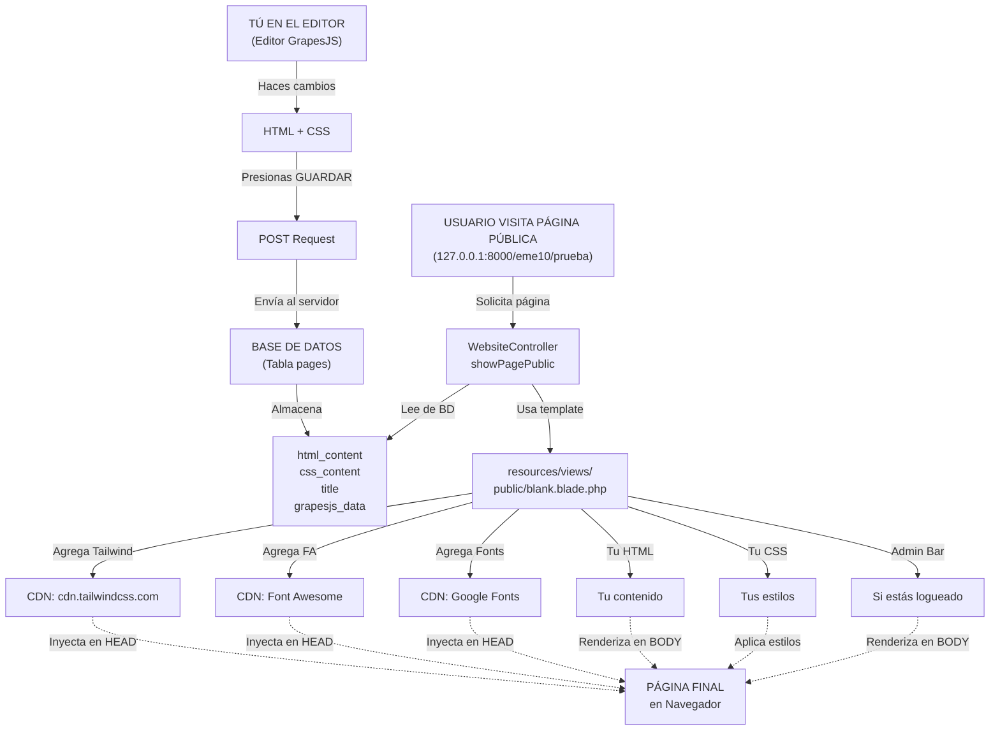

# 🎯 RESPUESTA DIRECTA A TU PREGUNTA

## Tu Pregunta
> "Revisa cómo se crea la página: ¿si solamente con lo que se guarda del creador o se le agrega más cosas?"

---

## ✅ RESPUESTA

### **Se crea con AMBAS cosas:**

#### **1️⃣ Lo que TÚ guardas del creador:**
```
✓ HTML del contenido (pages.html_content)
✓ CSS personalizado (pages.css_content)
✓ Título, descripción, meta tags
✓ Datos del editor GrapesJS
```

#### **2️⃣ Lo que el SISTEMA agrega automáticamente:**
```
✗ Tailwind CSS (desde CDN)
✗ Font Awesome (desde CDN)
✗ Google Fonts (desde CDN)
✗ Barra de administración (componente Blade)
✗ Estructura HTML básica (head, body tags)
✗ Variables JavaScript globales
```

---

## 📋 Flujo Técnico Completo



---

## 🔍 Exactamente Dónde Va Todo

### **En el HTML Resultante:**

```html
<!DOCTYPE html>
<html>
<head>
    <!-- Sistema -->
    <script src="https://cdn.tailwindcss.com"></script>  ← SISTEMA (CDN)
    <link rel="stylesheet" href="font-awesome.css">       ← SISTEMA (CDN)
    <link href="fonts.googleapis.com/...">               ← SISTEMA (CDN)
    
    <!-- TÚ (del editor) -->
    <style>
        {!! $page->css_content !!}  ← TU CSS del editor
    </style>
</head>
<body>
    <!-- Sistema -->
    <x-admin-bar />  ← SISTEMA (si estás logueado)
    
    <!-- TÚ (del editor) -->
    <div id="page-content">
        {!! $page->html_content !!}  ← TU HTML del editor
    </div>
    
    <!-- Sistema -->
    <script src="..."></script>  ← Varios scripts del sistema
</body>
</html>
```

---

## 📊 Tabla de Responsabilidad

| Elemento | ¿De Quién? | ¿Dónde se guarda? | Detalles |
|----------|-----------|-----------------|----------|
| HTML contenido | **EDITOR** | `pages.html_content` en BD | Lo que tú ves en el canvas |
| CSS personalizado | **EDITOR** | `pages.css_content` en BD | Solo si usas estilos custom |
| Tailwind CSS | **SISTEMA** | CDN remoto (no en BD) | Siempre presente, no guardado |
| Font Awesome | **SISTEMA** | CDN remoto (no en BD) | Siempre presente, no guardado |
| Google Fonts | **SISTEMA** | CDN remoto (no en BD) | Siempre presente, no guardado |
| Barra Admin | **SISTEMA** | Archivo `blank.blade.php` | Se agrega si estás autenticado |
| Meta tags | **EDITOR** | `pages.meta_*` en BD | Title, description, keywords |

---

## 🎯 Resumen Ejecutivo

### **El contenido que VES en la página real es:**

```
TUYO (guardado en BD)           +    SISTEMA (agregado automáticamente)
═════════════════════════════         ════════════════════════════════
  • Tu HTML                           • Tailwind CDN
  • Tu CSS                            • Font Awesome
  • Tu título                         • Google Fonts  
  • Tu descripción                    • Barra admin
                                      • Estructura HTML base
```

### **Si la página se ve diferente:**

```
Probable causa: El CSS o HTML no se guardó correctamente

Verificación:
1. Abre: http://127.0.0.1:8000/inspect-page-content.php?page_id=33
2. ¿HTML tiene caracteres? Si no → Edita y guarda
3. ¿CSS tiene caracteres? Si vacío → Normal si solo usas Tailwind
4. ¿Está publicada? Si no → Publica la página
5. Limpia caché: Ctrl+Shift+Del
```

---

## 🔬 Verificación Técnica

Para ver exactamente qué se guardó en la BD:

```bash
# Opción 1: Web (la más fácil)
http://127.0.0.1:8000/inspect-page-content.php?page_id=33

# Opción 2: Terminal
php public/inspect-cli.php 33

# Opción 3: phpMyAdmin
SELECT html_content, css_content, grapesjs_data 
FROM pages WHERE id = 33;
```

---

## 💡 Conclusión

**Tu pregunta respondida:**

> ¿Se crea SOLO con lo que se guarda del creador?

**No.** Se crea con:
- ✅ Lo que TÚ guardas (HTML, CSS, meta tags)
- ❌ Lo que el SISTEMA agrega (Tailwind, CDN, estructura base)

**Ambas cosas juntas = Página final que ves**

Si hay diferencias entre editor y página real, es casi siempre porque el HTML o CSS no se guardó correctamente. Usa el Inspector para verificar.

---

## 📚 Documentación Completa

Para más detalles, ve a [`TOOLS_INDEX.md`](TOOLS_INDEX.md)
